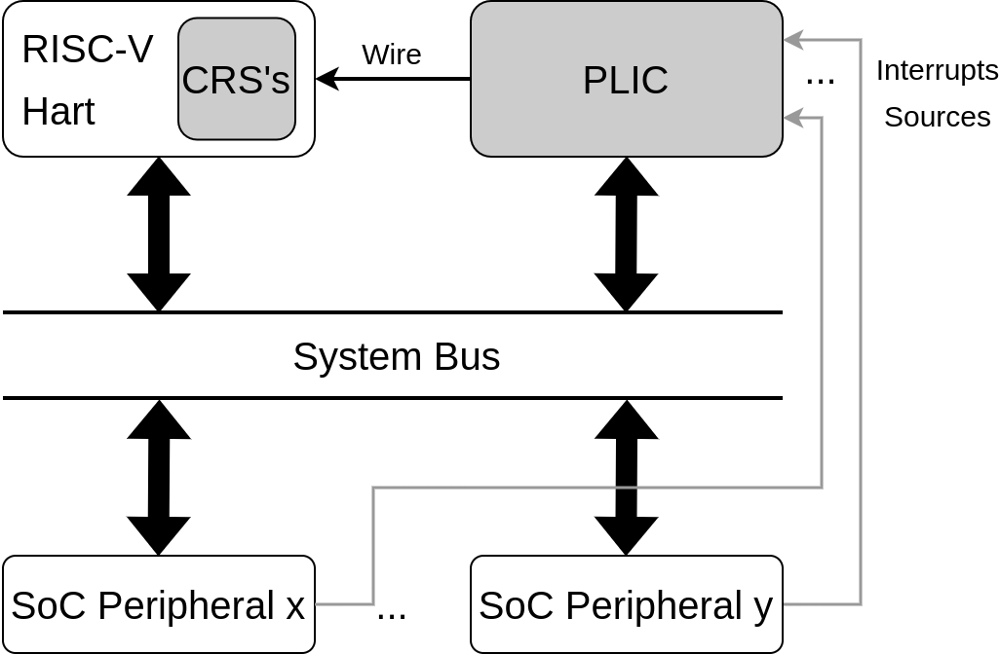
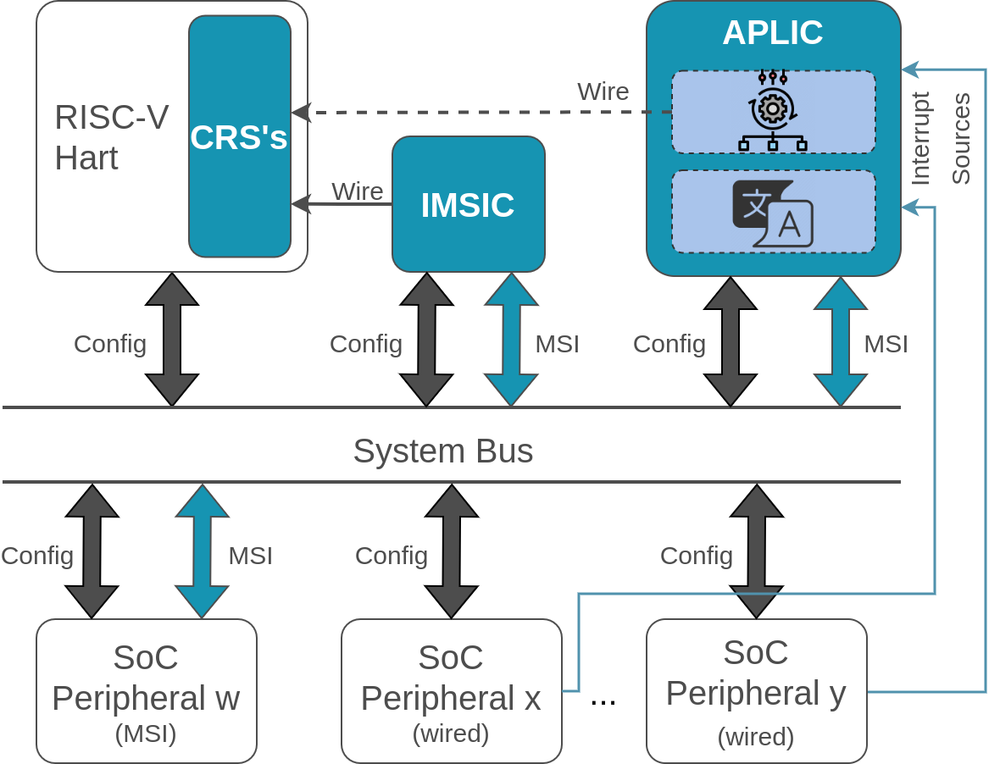

# Advanced Interrupt Architecture IP

## License

This work is licensed under a Apache-2.0 License and Solderpad Hardware License v2.1 (Apache-2.0 WITH SHL-2.1). See the [Apache LICENSE](./LICENSE.Apache) and [Solderpad LICENSE](./LICENSE.Solderpad) files for details.

## Disclaimer
This is a work in progress.

## About RISC-V AIA
Nowadays, the de facto interrupt controller in the RISC-V system is the Platform Level Interrupt Controller (PLIC). However, the PLIC specification, as it is, presents several limitations in terms of scalability and feature-richness. Among these limitations, we highlight: a large amount of physical address space used, and the sharing of M-mode and S-mode global registers, creating a possible security breach. The PLIC does not support interrupts through Message Signal Interrupts (MSI). Also, the Interrupt Request (IRQ) line sensing configuration is not allowed. Lastly, the PLIC does not provide any means to support virtualization.

In response to identified deficiencies in the PLIC, the RISC-V community has undertaken the development of a new interrupt controller specification. The RISC-V Advanced Interrupt Architecture (AIA) is the novel reference specification for interrupt-handling functionality. The specifications were recently ratified and are paving the way for integration in new RISC-V SoC designs.

AIA specification consists in:
1. An extension to the RISC-V privilege specification (Smaia and Ssaia);
2. Two standard interrupt controllers for RISC-V systems:
   a. Advanced Platform-Level Interrupt Controller (APLIC)
   b. Incoming Message-Signalled Interrupt Controller (IMSIC);
3. Requirements on other system components (e.g., IOMMU).

The Figure bellow shows the current interrupt controller model. It can be observed that wired sources are connected to the
PLIC, which for instance will be in charge of determining the interrupt prioritization and notify the CPU, by wire,
when an interrupt is available.

A SoC that implements the AIA specification will look like the Figure bellow. In scenarios where a platform opts not to incorporate an IMSIC, the absence of MSI channels results in the external interrupt controller responsibilities being assumed by the APLIC.

## Repository Structure

### Documentation (doc)
In the [documentation](doc/README.md) folder you can find information about APLIC and IMSIC IPs. How to integrate IP into a RISC-V platform, the interfacing of the hardware blocks, and how they are made up.

### RTL
The rtl folder houses all the modules that make up each of the IPs.

### Tests
Under the tests folder, you can find unit tests of IPs intergration. The tests can easily be replicated by doing make inside the desired test.

---

**NOTE**

To ensure accurate test reproduction, it is crucial to verify the versions of the tools being utilized (verilator and cocotb). Failure to do so may result in inconsistencies and unreliable test results.

---

## Tools and Versions
To run the test make sure you are using the right versions of cocotb and verilator. Currently cocotb only supports Verilator 5.006 and later. See cocotb [Simulator Support](https://docs.cocotb.org/en/stable/simulator_support.html) for more information.

| Package/Tool | Version     |
| ------------ | ----------- |
| Cocotb       | 1.8.0       |
| Verilator    | 5.006       |
| perl         |  |
| python3      |  |
| autoconf     |  |
| g++          |  |
| flex         |  |
| ccache       |  |
| bison        | 3.5.1       |

## Project Status

---

**NOTE**

The AIA IP presented in this repository was validated on a CVA6-based SoC, single core. We build the following SoC configurations:

1. Replace the PLIC for the APLIC (scalable and minimal version) in direct mode;
2. Implemented the full AIA IP - APLIC in msi mode (scalable and minimal version) + IMSIC with 3 interrupt files (M, S, and VS) + Smaia/Ssaia core extentions;

We successfully ran Linux vanilla on both configurations, firstly directly on hardware and then atop of [Bao hypevisor](https://github.com/bao-project/bao-hypervisor).

---

| AIA Module  | Status | Documentation |
|-------------|--------|---------------|
| APLIC (Scalable) | Done | [here](./doc/aplic/README.md) |  
| APLIC (Minimal) | Done |  |
| IMSIC | Done | [here](./doc/imsic/README.md) |
| Smaia/Ssaia | WiP    | |
| Scripts | WiP | |

### APLIC

#### Scalable
This APLIC implementation focus in high modularity and saclability. It implements a full APLIC domain, that can be instantiated using the parameters to define the domain level (M or S), number of interrupt sources, number of IDCs, if the domain is a LEAF domain, and the APLIC address in the SoC adress space. This is ideal for testing different APLIC configurations with more than one M domain and one S domain. Its versability allows developers to build in just a few minutes any APLIC microarchitecture configuration. The APLIC functioning mode (direct mode or MSI mode) is defined using the defines in aplic_defines.svh so we can implement just the necessary interface for each case. In this repository can be found an APLIC configuration using this APLIC version. The configurations consist of a M and S domain.

#### Minimal 
This APLIC implementation focus on lower resource usage, while providing some APLIC configurability. Our minimal APLIC implements only two domains (M and S). From the AIA specification can be read (section 4.5): *APLIC implementations can exploit the fact that each source is ultimately active in only one domain*. Thus, this minimal version implements only one domain and relies on logic to mask the interrupt to the correct domain. 

This implementation allows the following IP configurability: number of interrupt source lines, minimal priority, and number of IDCs.

### IMSIC
The IMSIC IP allows the following configurations: number of interrupt sources, number of interrupt files (at least 2 (M and S) are mandatory).

### Smaia/Ssaia
The AIA core extentions were implemented in the CVA6 core. Implementation can be found [here](https://github.com/zero-day-labs/cva6/tree/wip/aia). The major interrupts priority configuration feature was not implemented yet. The major interrupts priorities are the default priorities defined in AIA specification.

### Scripts
We are currently developing a set of scripts that provide developers with two essential capabilities. Firstly, these scripts enable developers to build aplic register maps tailored to their specific problem. This feature allows for a customized configuration of the register maps, ensuring alignment with the requirements of their project.

Secondly, the scripts automate the process of building an APLIC configuration, specifically targeting the scalable version. With this automation, developers can effortlessly construct an APLIC configuration that can easily scale to accommodate varying needs and evolving project demands.

By leveraging these scripts, developers can streamline the setup and configuration of APLIC, saving valuable time and effort.

## Take a look at our work

* RISC-V Summit Europe 2023 [Extended Abstract](https://riscv-europe.org/media/proceedings/posters/2023-06-08-Francisco-MARQU%C3%89S-DA-COSTA-abstract.pdf)
* RISC-V Summit Europe 2023 [Poster](https://riscv-europe.org/media/proceedings/posters/2023-06-08-Francisco-MARQU%C3%89S-DA-COSTA-poster.pdf)

## Next Steps
- [ ] Re-structure the project (Currently working on it);
- [ ] Clean, improve and add new tests;
- [ ] Write APLIC minimal documentation;
- [ ] Build a quad-core SoC (based on CVA6 core);