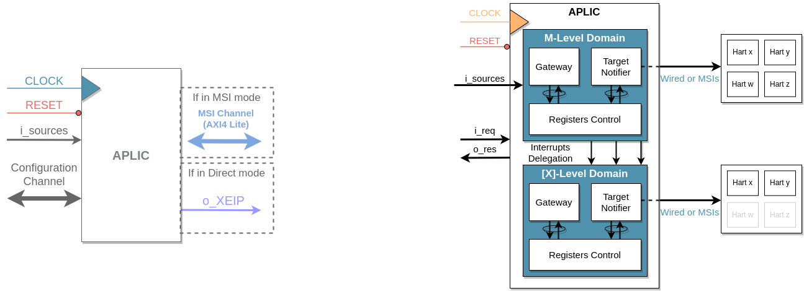
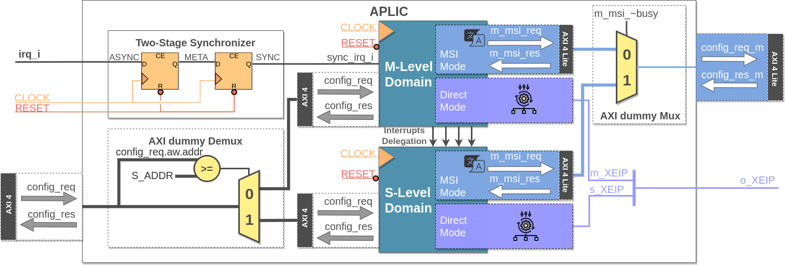
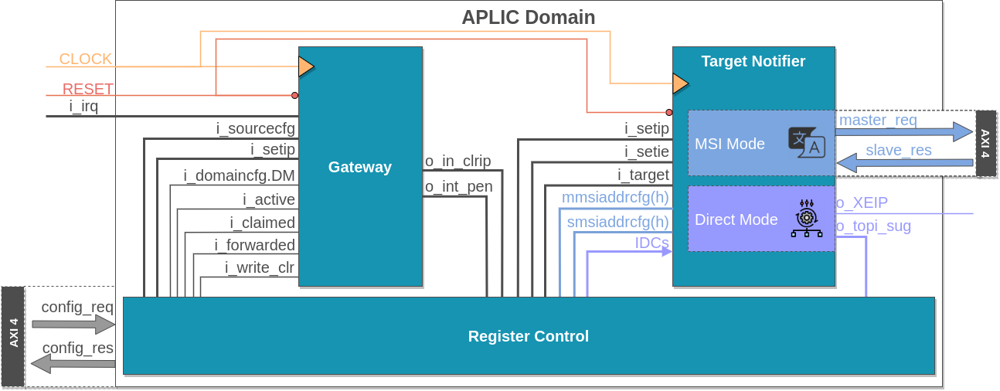
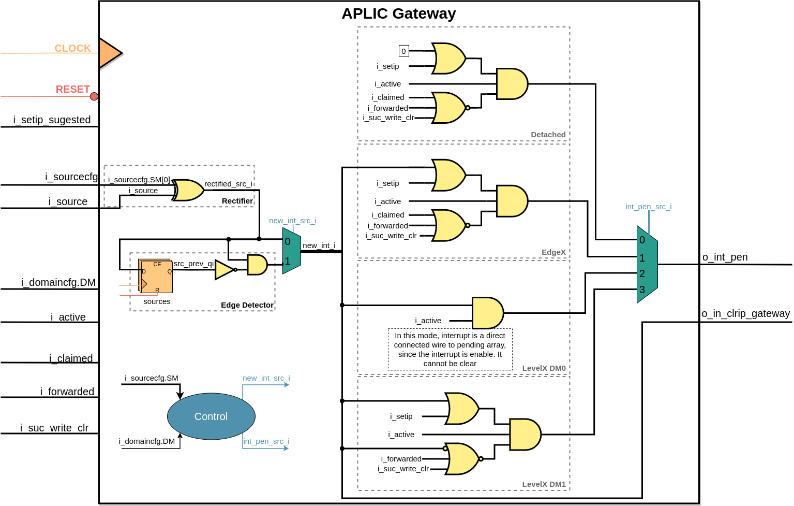
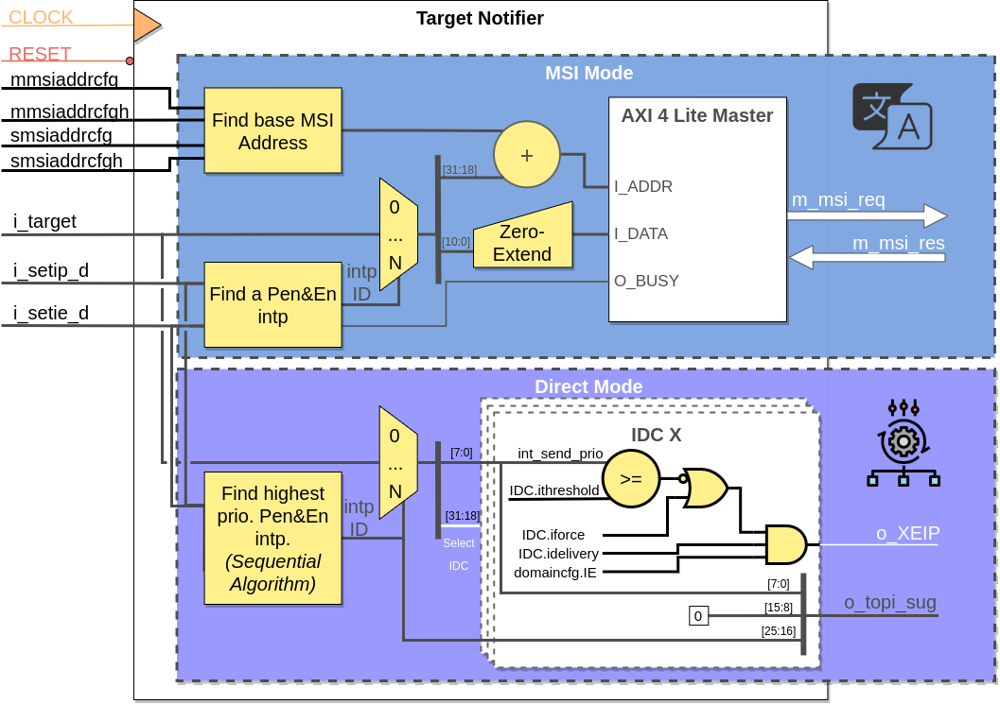

# Advanced Platform Level Interrupt Controller (APLIC)

## APLIC Interface

The APLIC interface was designed with the intention of aligning it closely with the interface of the Platform-Level Interrupt Controller (PLIC). This design decision ensures compatibility and facilitates a straightforward replacement of the PLIC with the APLIC within existing systems.

If the APLIC is configured in direct mode, the interface remains identical to that of the PLIC. This means that the APLIC interface will maintain the same interafce as the [Pulp PLIC](https://github.com/pulp-platform/rv_plic), enabling a seamless transition without any modifications required.

However, if the APLIC is configured in MSI mode, the interface undergoes some changes. In this mode, the notification single line that goes into the core is eliminated, and instead, an AXI4 interface is implemented. This AXI4 interface is connected to a bus, facilitating the transmission of MSIs to the respective hart's IMSIC.

By offering different interface modes, the APLIC provides flexibility to meet diverse system requirements. The direct mode maintains compatibility with existing PLIC-based systems, allowing for a straightforward replacement. On the other hand, the MSI mode introduces an AXI4 interface for efficient MSI delivery, enabling optimized interrupt handling and reducing latency.

The APLIC IP represents the instantiation and interconnection of a set of APLIC domains. It enables the seamless integration and communication between multiple APLIC domains, providing a comprehensive solution for interrupt management and control.

To ensure the stability and reliability of the interrupt source line connected to the root domain, a synchronizer is instantiated. The synchronizer prevents metastability issues, safeguarding against data corruption or loss in the interrupt signal.

## APLIC Domain Composition

The APLIC domain consists of three key modules: gateway, notifier, and register controller
By leveraging the capabilities of the APLIC domain and its constituent modules, developers can build robust systems with efficient interrupt handling and configuration. The modular design of the APLIC domain allows for flexibility and scalability, making it well-suited for various applications.

### Gateway 
The gateway module serves as the entry point for handling interrupt sources within the APLIC domain. It receives the interrupt source and its configuration, and evaluates whether an interrupt source can become pending. This module plays a crucial role in managing the flow of interrupts.

### Target Notifier
The notifier implementation in the APLIC domain depends on the supported delivery mode. In the case of direct mode, the notifier module incorporates an algorithm to identify the highest pending and enabled interrupt. However, in MSI mode, the notifier forwards newly pending and enabled interrupts to a hart's IMSIC using an AXI 4 lite interface. 

### Register Controller
The register controller is responsible for the management of APLIC registers. It provides the necessary functionality for configuring and controlling the registers within the APLIC domain. The device configuration interface utilizes AXI 4, offering enhanced modularity and scalability for the system.