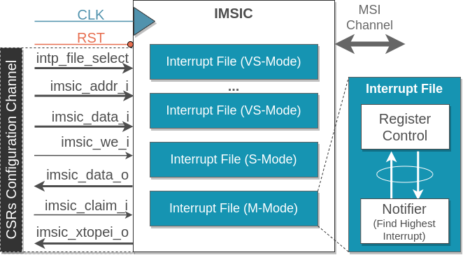

# Incoming Message-Signalled Interrupt Controller

## IMSIC Interface

The IMSIC (Interrupt Message Signaling Controller) interface and composition are designed to ensure efficient and flexible integration with the RISC-V core and enable seamless communication between the IMSIC and the core.

To facilitate the configuration of the IMSIC, it is essential to place it in close proximity to the RISC-V core. The IMSIC is primarily configured through writes and reads to the CSRs (Control and Status Registers), making proximity crucial for efficient communication.

The IMSIC is composed of two channels: the CSRs configuration channel and the MSI reception channel. The CSRs configuration channel is a custom channel specifically designed to allow the RISC-V hart to configure the IMSIC through reads and writes to the CSRs. This channel provides a straightforward and direct mechanism for the RISC-V core to control and adjust the IMSIC's behavior.

The second communication channel is responsible for receiving Message Signaled Interrupts (MSIs). To implement this channel, the AXI4 lite protocol is utilized due to its widespread use and maturity in RISC-V platforms. The AXI4 lite protocol provides a standardized and efficient means of communication between the IMSIC and the connected components.

## IMSIC Composition

A key consideration during the design of this IP was to ensure adaptability in the number of VS interrupt files that the IMSIC can handle. To address this, the top level of the IMSIC IP includes a parameter that enables quick scalability of the number of interrupt files supported by the IMSIC. This parameter allows system designers to easily adjust the IMSIC's capabilities based on their specific requirements, providing flexibility and scalability.

Overall, the IMSIC interface and composition prioritize efficient configuration, communication, and adaptability. By leveraging the CSRs configuration channel, the AXI4 lite protocol, and the parameter for scalable interrupt file support, the IMSIC IP offers a robust and flexible solution for managing interrupts in RISC-V-based systems.